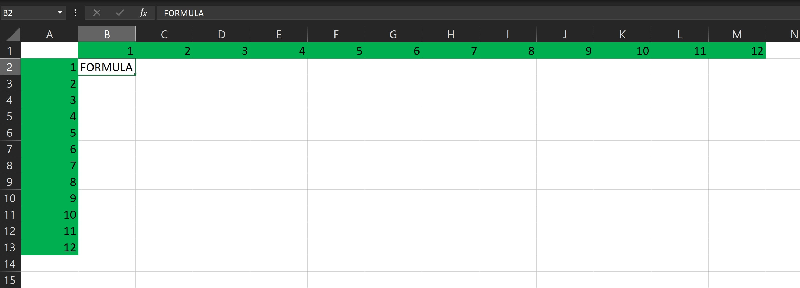

## Cell Referencing
The challenge was to test my ability in spreadsheet and to show how productive, accurate, and flexible I am in working with data.

## Problem Statement
Using Cell Referencing, write a formula that calculates and auto-populates a multiplication table into cell B2.

Use the fill handle in cell B2 to drag the formula across the entire multiplication table so it can auto-populate the cells

 

  
   

 

Objective:

The objective of the task is to use cell referencing to create a multiplication table that automatically populates the cells. The task will require the use of the fill handle to copy the formula from cell B2 to the rest of the cells in the table.

Conclusion:

The conclusion of the task is that a multiplication table has been created that automatically populates the cells. The table is created using cell referencing, which allows the formula to be copied from cell B2 to the rest of the cells. This makes the table easy to create and update, as the formula will automatically update when the values in cells B1 and A2 are changed.

Here are the steps involved in completing the task:

Create a new Excel spreadsheet.
Enter the values 1-10 in cells A2-A11.
Enter the value 1 in cell B1.
In cell B2, enter the formula =A2*B1.
Click and drag the fill handle in cell B2 down to cell A11.
The multiplication table will be automatically populated.

The formula in cell B2 uses cell referencing to calculate the product of the values in cells A2 and B1. The fill handle is then used to copy the formula to the rest of the cells in the table. This ensures that the table is automatically populated with the correct values.

The completion of this task demonstrates the ability to use cell referencing to create a multiplication table that automatically populates the cells. This is a valuable skill that can be used to automate tasks and save time.
